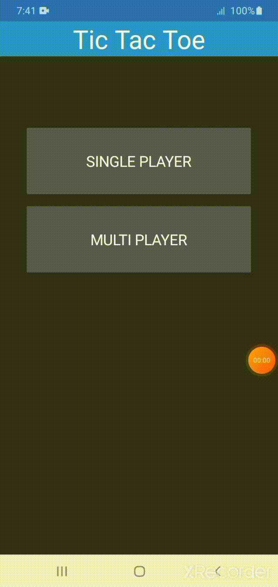

# TicTacToe Game
## My Second Android app with Xamarin(C#) framework.

Hello, My name is Abdella Solomon, This is a tictactoe game that is made using xamarin C# framework.
It have two options singleplayer and multiplayer. In Single Player, you will be playing with the computer(Hey! the computer plays randomly. you will be winning) and in the multiplayer, you will be playing with your friends. 

## How to run the code?
To run the code, you have to download the apk under the release page here https://github.com/Abdesol/tictactoe-android/releases/tag/1.0 then, install it on your phone.

## How it works?
 

I hope you enjoyed playing my game.
Any feedback is Acceptable!